<!-- MarkdownTOC levels="2,3" autolink="true" uri_encoding="false" markdown_preview="github" -->

- [1. Введение](#1-%D0%B2%D0%B2%D0%B5%D0%B4%D0%B5%D0%BD%D0%B8%D0%B5)
    - [1.1. Генеральная совокупность и выборка](#11-%D0%B3%D0%B5%D0%BD%D0%B5%D1%80%D0%B0%D0%BB%D1%8C%D0%BD%D0%B0%D1%8F-%D1%81%D0%BE%D0%B2%D0%BE%D0%BA%D1%83%D0%BF%D0%BD%D0%BE%D1%81%D1%82%D1%8C-%D0%B8-%D0%B2%D1%8B%D0%B1%D0%BE%D1%80%D0%BA%D0%B0)
    - [1.2. Меры центральной тенденции](#12-%D0%BC%D0%B5%D1%80%D1%8B-%D1%86%D0%B5%D0%BD%D1%82%D1%80%D0%B0%D0%BB%D1%8C%D0%BD%D0%BE%D0%B9-%D1%82%D0%B5%D0%BD%D0%B4%D0%B5%D0%BD%D1%86%D0%B8%D0%B8)
    - [1.3. Меры изменчивости](#13-%D0%BC%D0%B5%D1%80%D1%8B-%D0%B8%D0%B7%D0%BC%D0%B5%D0%BD%D1%87%D0%B8%D0%B2%D0%BE%D1%81%D1%82%D0%B8)
    - [1.4. Квантили распределения](#14-%D0%BA%D0%B2%D0%B0%D0%BD%D1%82%D0%B8%D0%BB%D0%B8-%D1%80%D0%B0%D1%81%D0%BF%D1%80%D0%B5%D0%B4%D0%B5%D0%BB%D0%B5%D0%BD%D0%B8%D1%8F)
    - [1.5. Нормальное распределение](#15-%D0%BD%D0%BE%D1%80%D0%BC%D0%B0%D0%BB%D1%8C%D0%BD%D0%BE%D0%B5-%D1%80%D0%B0%D1%81%D0%BF%D1%80%D0%B5%D0%B4%D0%B5%D0%BB%D0%B5%D0%BD%D0%B8%D0%B5)
    - [1.6. Доверительные интервалы](#16-%D0%B4%D0%BE%D0%B2%D0%B5%D1%80%D0%B8%D1%82%D0%B5%D0%BB%D1%8C%D0%BD%D1%8B%D0%B5-%D0%B8%D0%BD%D1%82%D0%B5%D1%80%D0%B2%D0%B0%D0%BB%D1%8B)
    - [1.7. Проверка гипотез](#17-%D0%BF%D1%80%D0%BE%D0%B2%D0%B5%D1%80%D0%BA%D0%B0-%D0%B3%D0%B8%D0%BF%D0%BE%D1%82%D0%B5%D0%B7)
- [2. Сравнение средних](#2-%D1%81%D1%80%D0%B0%D0%B2%D0%BD%D0%B5%D0%BD%D0%B8%D0%B5-%D1%81%D1%80%D0%B5%D0%B4%D0%BD%D0%B8%D1%85)
    - [2.1. Распределение Стьюдента](#21-%D1%80%D0%B0%D1%81%D0%BF%D1%80%D0%B5%D0%B4%D0%B5%D0%BB%D0%B5%D0%BD%D0%B8%D0%B5-%D1%81%D1%82%D1%8C%D1%8E%D0%B4%D0%B5%D0%BD%D1%82%D0%B0)
    - [2.2. Сравнение двух средних](#22-%D1%81%D1%80%D0%B0%D0%B2%D0%BD%D0%B5%D0%BD%D0%B8%D0%B5-%D0%B4%D0%B2%D1%83%D1%85-%D1%81%D1%80%D0%B5%D0%B4%D0%BD%D0%B8%D1%85)
    - [2.3. Проверка на нормальность](#23-%D0%BF%D1%80%D0%BE%D0%B2%D0%B5%D1%80%D0%BA%D0%B0-%D0%BD%D0%B0-%D0%BD%D0%BE%D1%80%D0%BC%D0%B0%D0%BB%D1%8C%D0%BD%D0%BE%D1%81%D1%82%D1%8C)
    - [2.4. Однофакторный дисперсионный анализ \(one-way ANOVA\)](#24-%D0%BE%D0%B4%D0%BD%D0%BE%D1%84%D0%B0%D0%BA%D1%82%D0%BE%D1%80%D0%BD%D1%8B%D0%B9-%D0%B4%D0%B8%D1%81%D0%BF%D0%B5%D1%80%D1%81%D0%B8%D0%BE%D0%BD%D0%BD%D1%8B%D0%B9-%D0%B0%D0%BD%D0%B0%D0%BB%D0%B8%D0%B7-one-way-anova)
    - [2.5. Множественные сравнения](#25-%D0%BC%D0%BD%D0%BE%D0%B6%D0%B5%D1%81%D1%82%D0%B2%D0%B5%D0%BD%D0%BD%D1%8B%D0%B5-%D1%81%D1%80%D0%B0%D0%B2%D0%BD%D0%B5%D0%BD%D0%B8%D1%8F)
    - [2.6. Многофакторный дисперсионный анализ \(n-way ANOVA\)](#26-%D0%BC%D0%BD%D0%BE%D0%B3%D0%BE%D1%84%D0%B0%D0%BA%D1%82%D0%BE%D1%80%D0%BD%D1%8B%D0%B9-%D0%B4%D0%B8%D1%81%D0%BF%D0%B5%D1%80%D1%81%D0%B8%D0%BE%D0%BD%D0%BD%D1%8B%D0%B9-%D0%B0%D0%BD%D0%B0%D0%BB%D0%B8%D0%B7-n-way-anova)
- [3. Корреляция и регрессия](#3-%D0%BA%D0%BE%D1%80%D1%80%D0%B5%D0%BB%D1%8F%D1%86%D0%B8%D1%8F-%D0%B8-%D1%80%D0%B5%D0%B3%D1%80%D0%B5%D1%81%D1%81%D0%B8%D1%8F)
    - [3.1. Корреляция](#31-%D0%BA%D0%BE%D1%80%D1%80%D0%B5%D0%BB%D1%8F%D1%86%D0%B8%D1%8F)
    - [3.2. Простая линейная регрессия](#32-%D0%BF%D1%80%D0%BE%D1%81%D1%82%D0%B0%D1%8F-%D0%BB%D0%B8%D0%BD%D0%B5%D0%B9%D0%BD%D0%B0%D1%8F-%D1%80%D0%B5%D0%B3%D1%80%D0%B5%D1%81%D1%81%D0%B8%D1%8F)
    - [3.3. Регрессионный анализ с несколькими независимыми переменными](#33-%D1%80%D0%B5%D0%B3%D1%80%D0%B5%D1%81%D1%81%D0%B8%D0%BE%D0%BD%D0%BD%D1%8B%D0%B9-%D0%B0%D0%BD%D0%B0%D0%BB%D0%B8%D0%B7-%D1%81-%D0%BD%D0%B5%D1%81%D0%BA%D0%BE%D0%BB%D1%8C%D0%BA%D0%B8%D0%BC%D0%B8-%D0%BD%D0%B5%D0%B7%D0%B0%D0%B2%D0%B8%D1%81%D0%B8%D0%BC%D1%8B%D0%BC%D0%B8-%D0%BF%D0%B5%D1%80%D0%B5%D0%BC%D0%B5%D0%BD%D0%BD%D1%8B%D0%BC%D0%B8)
    - [3.4. Выбор наилучшей модели](#34-%D0%B2%D1%8B%D0%B1%D0%BE%D1%80-%D0%BD%D0%B0%D0%B8%D0%BB%D1%83%D1%87%D1%88%D0%B5%D0%B9-%D0%BC%D0%BE%D0%B4%D0%B5%D0%BB%D0%B8)

<!-- /MarkdownTOC -->

-------------------------------------------------------------------------------
# Основы статистики I

-------------------------------------------------------------------------------
## 1. Введение

### 1.1. Генеральная совокупность и выборка

Хотим, чтобы **выборка** (sample) была репрезентативна **генеральной совокупности** (population) (т.е. отражала её свойства). Есть несколько способов этого добиться:

1. **Простая случайная выборка** (simple random sample).
2. **Стратифицированная выборка** (stratified sample).
    Генеральная совокупность разбивается на несколько разнородных групп (например, население по полу, возрасту и т.д.), а затем уже из каждой группы случайно выбираются элементы. 
3. **Групповая выборка** (cluster sample).
    Генеральная совокупность разбивается на несколько групп схожего состава (например, население города по районам), а затем случайная выборка берётся только из нескольких групп (кластеров).

Нас интересуют характеристики генеральной совокупности, которые мы исследуем с помощью выборки.

Типы переменных:

1. **Количественные** (numerical): порядок и метрика.
    - непрерывные
    - дискретные
2. **Порядковые**, или ранговые (ordinal): порядок без метрики.
3. **Категориальные**, или номинативные (categorical): ни метрики, ни порядка.

### 1.2. Меры центральной тенденции

Для исследования распределений изучаемых признаков элементов генеральной совокупности строят **гистограммы частот**. Если распределение асимметрично или есть большие выбросы, то вместо среднего лучше использовать моду и медиану:

**Мода** (mode) — значение признака, которое встречается максимально часто.

**Медиана** (median) — значение признака, которое делит упорядоченное множество данных пополам.

Свойства среднего значения:

1. $M_{x + C} = M_x + C \,,$
2. $M_{C x} = C \, M_x \,,$
3. $\sum_i \left( x_i - M_x \right) = 0 \,.$

### 1.3. Меры изменчивости

**Размах** (range) — разность максимального и минимального значения.

$$
R = x_{max} - x_{min}\,.
$$

**Дисперсия** (variance) — средний квадрат отклонений значений признака от их средней величины.

$$
D = \dfrac{\sum_i \left( x_i - \bar{x} \right)^2}{n} \quad \text{ для генеральной совокупности,} \\
D_x = \dfrac{\sum_i \left( x_i - \bar{x} \right)^2}{n - 1} \quad \text{ для выборки.}
$$

**Стандартное отклонение** (standard deviation) — среднее отклонение индивидуальных значений признака от их средней величины.

$$
\sigma = \sqrt{D} \quad \text{ для генеральной совокупности,} \\
s_x = \sqrt{D} \quad \text{ для выборки.}
$$

Свойства дисперсии и стандартного отклонения:

1. $D_{x + C} = D_x \,,$
2. $D_{C x} = C^2 D_x \,,$
3. $s_{x + C} = s_x \,,$
4. $s_{C x} = |C| s_x \,.$

### 1.4. Квантили распределения

**Квантили** — значения признака, которые делят упорядоченные данные на некоторое число равных частей (например, медиана или квартили).

**Квартили** — три значения признака, которые делят данные на четыре равные части.

Используя квартили можно построить **box-plot**: коробка, где центр — медиана (второй квартиль), верхная граница — третий квартиль, нижняя — первый. Плюс две линии с максимальной длиной в 1.5 межквартильного размаха вверх и вниз, а также отдельные точки на краях распределения (если не попали в коробку).

### 1.5. Нормальное распределение

$$
f(x) = \dfrac{1}{\sqrt{2 \pi} \sigma} \, \exp \left(-\dfrac{\left(x - \mu\right)^2}{2 \sigma^2}\right)\,.
$$

Свойства нормального распределения:

- унимодальность
- симметричность
- "правило трёх сигм"
- центральная предельная теорема (средние значения для набора случайных выборок из данной генеральной совокупности распределены нормально с характеристиками $\bar{x}$ и $s_{\bar{x}}$).

$$
\bar{x} = \mu \,, \qquad s_{\bar{x}} = \dfrac{\sigma}{\sqrt{n}} \, \stackrel{n > 30}{\approx} \, \dfrac{s_x}{\sqrt{n}}.
$$

**Стандартизация** (Z-преобразование) – преобразование данных в стандартную шкалу (standard score) с характеристиками $M_z = 0$ и $D_z = 1$.

$$
Z_i = \dfrac{x_i - \bar{x}}{s_x} \,.
$$

### 1.6. Доверительные интервалы

Центральная предельная теорема позволяет по полученным значениям признаков конкретной выборки делать выводы о значениях этих признаков для генеральной совокупности с определёнными **доверительными интервалами** (confidence intervals).

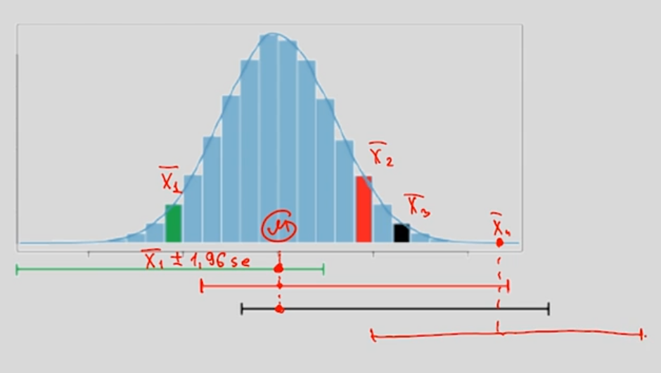

Например, что для генеральной совокупности $\mu = \bar{x} \pm m \, s_{\bar{x}}$. Здесь, $m$ — коэффициент, определяемый из требуемой уверенности предсказаний.

| Интервал | Доля внутри интервала |
|:--------:|:---------------------:|
|   μ ± σ  |  0.682689 492 137 086 |
|  μ ± 2σ  |  0.954499 736 103 642 |
|  μ ± 3σ  |  0.997300 203 936 740 |
|  μ ± 4σ  |  0.999936 657 516 334 |
|  μ ± 5σ  |  0.999999 426 696 856 |

### 1.7. Проверка гипотез

$H_0$ — нулевая гипотеза, $H_1$ — альтернативная гипотеза.

0. Допустить, что верна $H_0$, т.е. никаких различий значений признаков между выборкой и генеральной совокупностью нет.  
1. Рассчитать вероятность получить наблюдаемые (или большие) различия случайно при условии верности $H_0$ (**p-уровень значимости** или p-value).  
2. На основании уровня значимости, принять решение о состоятельности $H_0$.  

Пусть известно $\mu$ — среднее значение генеральной совокупности, а также получены значения $\bar{x}$ и $s_{x}$ для некоторой выборки из $N$ элементов. Тогда $H_0$ — различия между $\mu$ и $\bar{x}$ случайны и истинное значение среднего для генеральной совокупности равно $\mu$.

Чтобы посчитать уровень значимости для $H_0$ сначала найдём $s_{\bar{x}}$ и посмотрим на сколько среднее выборки $\bar{x}$ отклоняется от среднего генеральной совокупности $\mu$ в единицах стандартного отклонения среднего $s_{\bar{x}}$.

$$
s_{\bar{x}} = \dfrac{s_x}{\sqrt{N}} \,, \qquad Z_{\bar{x}} = \dfrac{\bar{x} - \mu}{s_{\bar{x}}}.
$$

Получив $Z_{\bar{x}}$, найдём вероятность получить значение в интервале $|Z| > Z_{\bar{x}}$ :

$$
p \left( |Z| > Z_{\bar{x}} \right) = \int\limits_{- \infty}^{Z_{\bar{x}}} f(Z) \, dZ + \int\limits_{Z_{\bar{x}}}^{+ \infty} f(Z) \, dZ \,.
$$

Тогда $p$ — вероятность того, что значение $\bar{x}$ (или ещё больше отличающееся от $\mu$) случайно, при предположении, что $\mu$ — среднее значение генеральной совокупности (т.е. верности $H_0$).

Подробней про [уровни значимости](https://habr.com/en/company/stepic/blog/250527/).

1. Уровень значимости — это **НЕ** вероятность верности нулевой гипотезы.
    $$
    p(observation | hypothesis) \neq p(hypothesis | observation).
    $$
2. Если уровень значимости слишком большой, то вывод: недостаточно оснований для отклонения $H_0$.
3. Уровень значимости ничего не говорит ни о правильности, ни о научности результатов.

**Статистические ошибки**:

1. Отклонили $H_0$, хотя она верна (**ложно-положительная**).
2. Не отклонили $H_0$, хотя она неверна (**ложно-отрицательная**).

-------------------------------------------------------------------------------
## 2. Сравнение средних

### 2.1. Распределение Стьюдента

Из центральной предельной теоремы знаем, что средние значения для выборок из генеральной совокупности распределятся нормально вокруг среднего генеральной совокупности:

$$
Z = \frac{\bar{x} - \mu}{\frac{\sigma}{\sqrt{n}}} \,.
$$

Однако, на практике стандартное отклонение генеральной совокупности $\sigma$ почти всегда неизвестно, поэтому используют стандартное отклонение выборки $s_x$, но тогда распределение будет уже не нормальным. Это и будет **распределение Стьюдента** (t-distribution). Оно похоже на нормальное (унимодально и симметрично), но слабее прижато к среднему значению (зависит от числа степеней свободы $\nu$).

$$
t = \frac{\bar{x} - \mu}{\frac{s_x}{\sqrt{n}}} \,.
$$

Форма распределения определяется числом степеней свободы ($\nu = n - 1$). Чем больше $\nu$, тем распределение ближе к нормальному.

Если $n > 30$, то часто из соображений удобства вместо t-распределения используют нормальное распределение, хотя это всё таки не верно. Поэтому следует использовать t-распределение при проверке гипотез и расчёте доверительных интервалов (!).

### 2.2. Сравнение двух средних

**t-критерий Стьюдента** (парный t-тест) — критерий, позволяющий сравнивать две выборки между собой.

- Допустим даны две выборки $X_1$ и $X_2$ и хотим проверить взяты ли они из одной генеральной совокупности (нулевая гипотеза). Для этого найдём вероятность получить данные выборки, при условии верности $H_0$, т.е. что $\mu_1 = \mu_2$.

- Если извлекать выборки $X_1$ и $X_2$ много раз, то величина $\bar{x_1} - \bar{x_2}$ будет иметь t-распределение с $\nu = n_1 + n_2 - 2$

    $$
    t = \dfrac{\left( \bar{x}_1 - \bar{x}_2 \right) - \left( \mu_1 - \mu_2 \right)}{\sqrt{\frac{s_{X_1}^2}{n_1} + \frac{s_{X_1}^2}{n_2}}} \, \stackrel{H_0}{=} \, \dfrac{\bar{x}_1 - \bar{x}_2}{\sqrt{\frac{s_{X_1}^2}{n_1} + \frac{s_{X_1}^2}{n_2}}} \,.
    $$

- Посчитав $t$ можно найти уровень значимости $H_0$ (p-value) при данных значениях $\bar{x_1}$ и $\bar{x_2}$.

Требования на использование t-критерия:

1. Дисперсии $X_1$ и $X_2$ должны быть близки (гомогенность дисперсий). Это можно проверить используя критерий Левена (Levene's test) или критерий Фишера.
2. Если объём выборок небольшой, то важно, чтобы они были нормально распределены.

**Примеры**:

1. Первая выборка — это пациенты, которых лечили препаратом А. Вторая выборка — пациенты, которых лечили препаратом Б. Значения в выборках — это некоторая характеристика эффективности лечения (уровень метаболита в крови, температура через три дня после начала лечения, срок выздоровления, число койко-дней, и т.д.) Требуется выяснить, имеется ли значимое различие эффективности препаратов А и Б, или различия являются чисто случайными и объясняются «естественной» дисперсией выбранной характеристики.

2. Первая выборка — это значения некоторой характеристики состояния пациентов, записанные до лечения. Вторая выборка — это значения той же характеристики состояния тех же пациентов, записанные после лечения. Объёмы обеих выборок обязаны совпадать; более того, порядок элементов (в данном случае пациентов) в выборках также обязан совпадать. Такие выборки называются связными. Требуется выяснить, имеется ли значимое отличие в состоянии пациентов до и после лечения, или различия чисто случайны.

3. Первая выборка — это поля, обработанные агротехническим методом А. Вторая выборка — поля, обработанные агротехническим методом Б. Значения в выборках — это урожайность. Требуется выяснить, является ли один из методов эффективнее другого, или различия урожайности обусловлены случайными факторами.

4. Первая выборка — это дни, когда в супермаркете проходила промо-акция типа А (красные ценники со скидкой). Вторая выборка — дни промо-акции типа Б (каждая пятая пачка бесплатно). Значения в выборках — это показатель эффективности промо-акции (объём продаж, либо выручка в рублях). Требуется выяснить, какой из типов промо-акции более эффективен.

### 2.3. Проверка на нормальность

Для проверки распределения выборки на нормальность (или в общем случае на соответствие любому распределению) часто используют **QQ plot** (quantile-quantile plot).

Для этого разделяют выборку и теоретическое распределение $n$ квантилями (где $n$ — число измерений в выборке), и строят набор $n + 1$ точек $(q_{theory}^i, q_{sample}^i)$. Если распределение в выборке нормально, то все точки лягут на диагональную прямую.

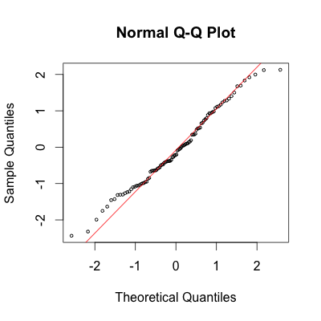

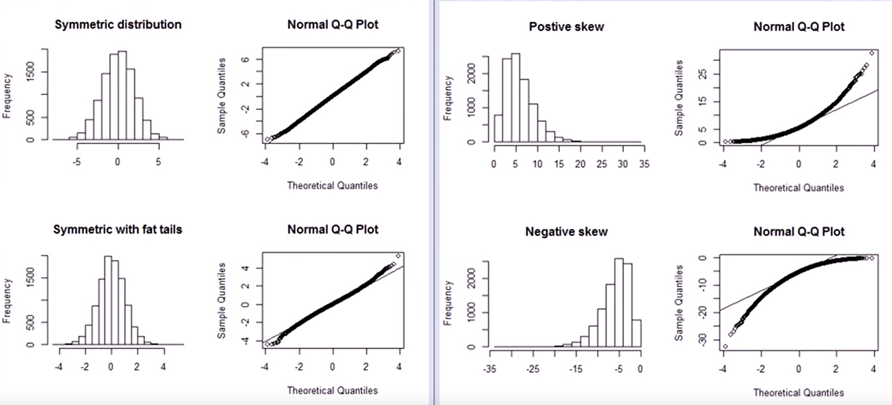

- Если нужно сравнить распределения двух выборок, то процесс аналогичный, только берут число квантилей, соответствующее выборке с наименьшим числом данных.

- Кроме QQ графиков для проверки на нормальность также используют **тест Колмогорова-Смирнова** и **тест Шапиро-Уилка**.

- Отклонения от нормальности может негативно повлиять на результаты исследований, например когда в выборке появляются большие выбросы. Чтобы избежать их влияния, например, вместо t-критерия используют его непараметрический аналог **U-тест Манна-Уитни** (переводит данные в ранговую шкалу).

### 2.4. Однофакторный дисперсионный анализ (one-way ANOVA)

Часто в исследованиях возникает необходимость сравнить несколько групп между собой, в таком случае применяют **однофакторный дисперсионный анализ**. Категориальная переменная, которая будет разделять наблюдения на группы называется независимой переменной, а та количественная переменная, по степени выраженности которой мы сравниваем группы, называется зависимой переменной.

**Условия применимости**:

- нормальность распределения зависимой переменной в каждой из групп (проверить с помощью QQ plot или тестом Шапиро-Уилка)

- гомогенность дисперсий в группах (проверить тестом Левена или другими критериями)

- при большом числе измерений дисперсионный анализ устойчив к нарушению обоих вышеизложенных требований

Пусть выборка разделена на $m$ групп, а $H_0$ — все различия между группами случайны и в генеральной совокупности $\mu_1 = \cdots = \mu_m$ (альтернатива — хотя бы две группы различаются). Для анализа групп рассчитаем следующие характеристики:

1. Общую сумму квадратов (**sum squared total**) $SST = \sum_{i = 1}^{N} \left( x_i - \bar{x} \right)^2$  и число степеней свободы всей выборки $df_{total} = N - 1$.

2. Внутригрупповую сумму квадратов (**within**) $SSW = \sum_{j = 1}^{m} \sum_{i = 1}^{n_j} \left( x_i^{(j)} - \bar{x}^{(j)} \right)^2$ и внутригрупповое число степеней свободы $df_{wg} = N - m$.

3. Межгрупповую сумму квадратов (**between**) $SSВ = \sum_{j = 1}^{m} n_j \, \left( \bar{x}^{(j)} - \bar{x} \right)^2$ и межгрупповое число степеней свободы $df_{bg} = m - 1$.

$$
SST = SSW + SSB \,, \qquad df_{total} = df_{wg} + df_{bg} \,.
$$

Т.е. если большая часть $SST$ происходит из $SSB$, то это намекает на то, что группы различны между собой. Для количественной оценки используют **F-значение** (чем больше, тем вероятней различие между группами):

$$
F = \dfrac{SSB / df_{bg}}{SSW / df_{wg}} = \dfrac{MS_{bg}}{MS_{wg}} \,.
$$

Для расчета вероятности получить такие (или ещё более сильные) различия случайно при условии верности $H_0$ нужно подставить полученное значение $F$ в распределение Фишера и посчитать интеграл

$$
p \left( F' > F \right) = \int\limits_{F}^{+ \infty} f(df_{bg}, df_{wg}, F') \, dF' \,.
$$

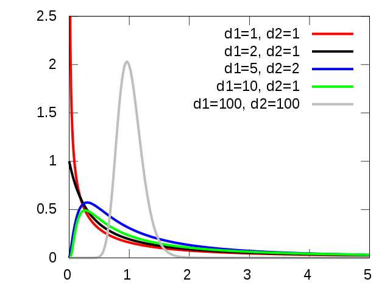

**Пример**:

Сравнивается 4 типа генотерапии и их эффективность:

Вывод: наличие различия между группами статистически достоверно, однако пока **нельзя** сделать вывод между какими именно группами оно есть.

### 2.5. Множественные сравнения

Если многократно извлекать из генеральной совокупности выборки из $m$ групп по $n$ элементов в каждой группе, а затем проверять с помощью t-критерия есть ли основания полагать, что между хотя бы какими-то двумя группами в выборке есть статистически значимые различия, то окажется, что вероятность получить положительный ответ на этот вопрос чисто случайно (совершить ошибку $I$-ого рода) стремится к единице при увеличении $n$ и $m$.  

Для корректировки результата нужно изменить используемый уровень значимости, в соответствии с количеством групп $m$ (**поправки на множественное сравнение**).

1. **Поправка Бонферони** (Bonferroni correction).

    Разделить p-value на количество парных сравнений (очень консервативный показатель), т.е.

    $$
    p_m = \dfrac{p_0}{N_{m}} \quad \,, \text{где} \, N_{m} = \binom{m}{2} = \dfrac{m \, (m -1)}{2} \,.
    $$

2. **Поправка Тьюки** (Tukey correction).

    Критерий Тьюки для оценки различия между группами:

    $$
    q_{i j} = \frac{\overline x_i - \overline x_j}{SE_{i j}}, \quad  {SE}_{i j} = \displaystyle\sqrt{\frac{MSW_{ij}}{2}\left (\frac{1}{n_i}+\frac{1}{n_j}\right )} \,.
    $$

    Доверительный интервал же рассчитывается с помощью [Studentized range distribution](https://en.wikipedia.org/wiki/Studentized_range_distribution).

**Пример**:

Пример про генотерапию из прошлого параграфа:

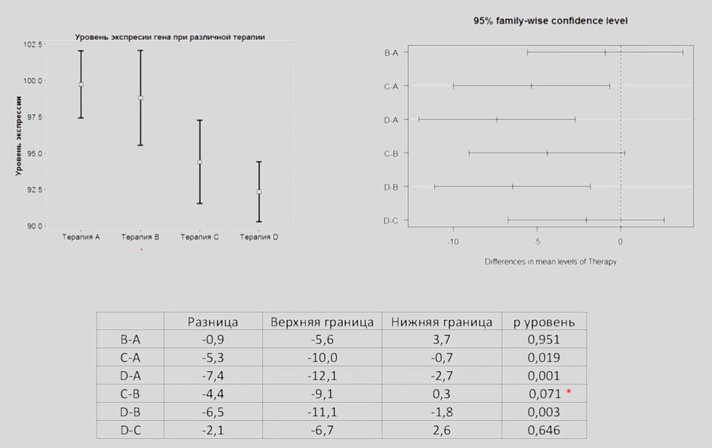

Можно сделать вывод, что статистически достоверно отличаются между собой только группы C и A, D и A, D и B (доверительные интервал для разности их средних не включает в себя ноль).

- Если не использовать поправки на множественное сравнение, то очень легко делать неверные выводы: [Статистика и плохая наука — Александр Панчин](https://www.youtube.com/watch?v=7To5LPZ9mxc).

- Любые данные можно дообрабатывать до такой степени, чтобы найти в них, что угодно, поэтому стоит формулировать проверяемые гипотезы до эксперимента. Однако, это не значит, что не нужно искать новые закономерности во время обработки данных (а затем проводить новые эксперименты).

### 2.6. Многофакторный дисперсионный анализ (n-way ANOVA)

Аналогичен однофакторному, только теперь есть несколько независимых категориальных переменных (т.е. несколько признаков разделения выборки на группы). При этом также следует проверять **взаимодействие факторов** между собой (влияние одного фактора на зависимую переменную может по-разному проявляться в зависимости от значения другого фактора). 

Например, для двух факторов $SST = SSW + SSB_A + SSB_B + SSB_A \, SSB_B$.

**Пример**:

1. Компания, разрабатывающая мобильные телефоны, перед выпуском двух новых моделей, решила выяснить, как потенциальные пользователи воспринимают эти новинки. Для этого компания набрала фокус-группу (100 мужчин, 100 женщин) и попросила участников оценить дизайн новых моделей телефонов от 1 до 100. Чтобы проанализировать полученные результаты, был применен двуфакторный дисперсионный анализ (зависимая переменная — оценка испытуемых по 100-балльной шкале, независимые переменные (факторы) — номер модели и пол испытуемых). 

    
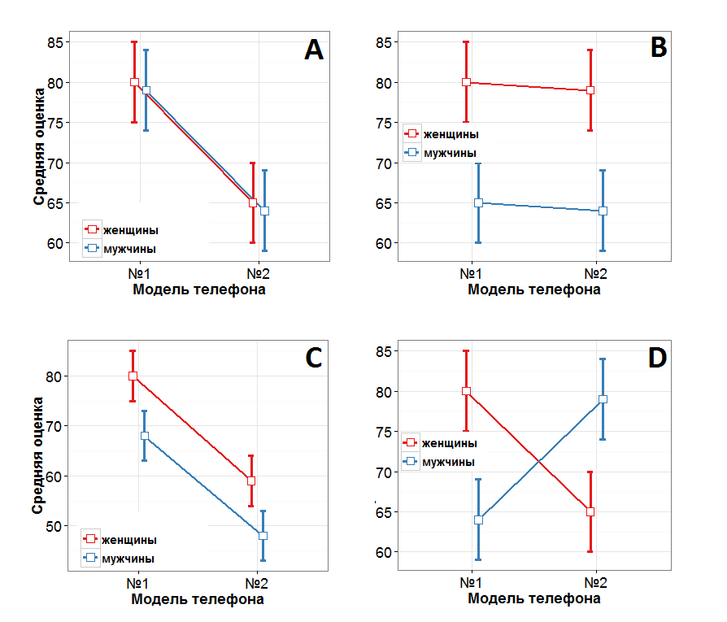

    A — значимый эффект только для фактора модели телефона, B — значимый эффект только для фактора пола участников исследования, C — значимый эффект для обоих факторов, D — значимое взаимодействие факторов.

2. Влияние инъекции некоторого гормона на концентрацию кальция в плазме крови у птиц с учётом пола.

    

    Получилось, что ни фактор пола, ни фактор гормона по отдельности не оказывают значимого влияния на зависимую переменную, однако их взаимодействие — оказывает.

-------------------------------------------------------------------------------
## 3. Корреляция и регрессия

### 3.1. Корреляция

**Корреляция** — взаимосвязь двух количественных переменных.

Качественно наличие взаимосвязи можно увидеть с помощью **ковариации**, а количественно оценить степень и направление взаимосвязи позволяет **коэффициент корреляции** (Пирсона).

$$
\mathrm{cov}\left( X, Y \right) = \dfrac{\sum_i \left( X_i - \bar{X} \right) \left( Y_i - \bar{Y} \right)}{N - 1} = \bar{X Y} - \bar{X} \bar{Y} \,, \\
r_{X Y} = \dfrac{\mathrm{cov}\left( X, Y \right)}{\sigma_{X}\sigma_{Y}} = \dfrac{\bar{X Y} - \bar{X} \bar{Y}}{ \sqrt{\sum_i(X_i - \bar{X})^2\sum_i(Y_i - \bar{Y})^2}} \,.
$$

- $r_{X Y} \in [-1, 1]$.

- большой коэффициент корреляции не обязательно означает статистически значимую взаимосвязь (например, при малом числе наблюдений значение $r_{X Y}$ велико).

- корреляция $\neq$ причинно-следственная связь (хотя может быть аргументом в её пользу).

    - Николас Кейдж и число утонувших в бассейне

        
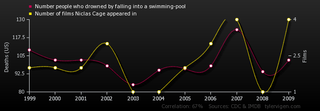

    - Исследование показало, что чем больше пожарных расчетов выезжает на пожар, тем больше от него ущерб.

- коэффициент корреляции Пирсона работает только в случае монотонной линейной связи.

    
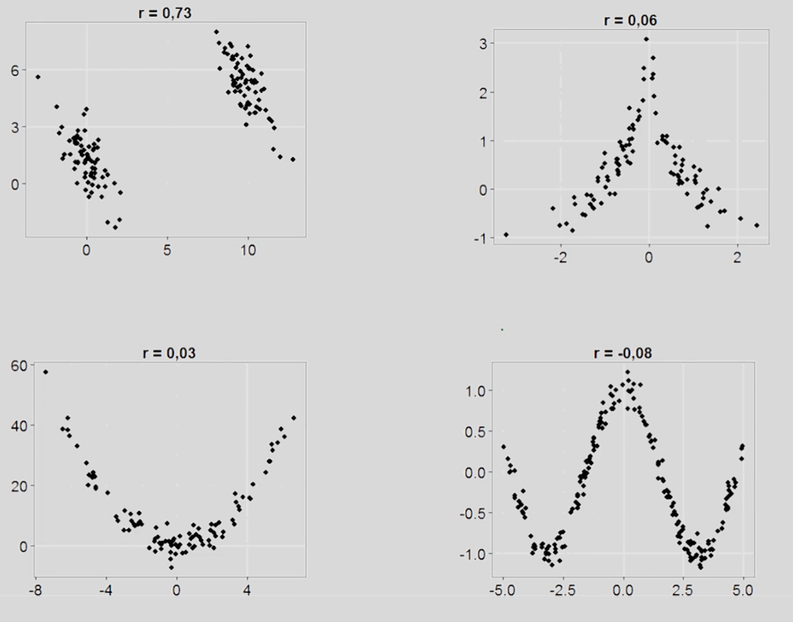

- требуется нормальное распределение исследуемых переменных (большие выбросы, бимодальность, асимметрия плохо сказываются на значении коэффициента корреляции, делая его бесполезным). Однако у коэффициента Пирсона есть непараметрические (ранговые) аналоги — **коэффициент корреляции Спирмена** и **коэффициент корреляции $\tau$-Кендалла**.

    
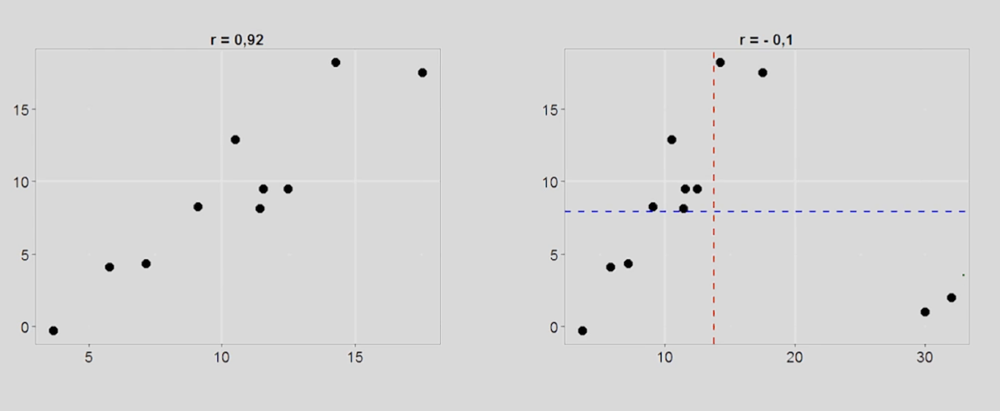

### 3.2. Простая линейная регрессия

**Регрессионный анализ** — совокупность методов позволяющих исследовать взаимосвязь исследуемых переменных между собой.

**МНК** — один из способов нахождения оптимальных параметров линейной регрессии (минимизируется сумма квадратов ошибок $\sum_i e^2_i = \sum_i \left( y_i - \hat{y_i} \right)^2$, см. численные методы).

Одномерная линейная регрессия:

$$
\hat{y} = b_0 + b_1 \,x \,, \text{где} \quad \begin{matrix} b_1 = \dfrac{s_y}{s_x} \, r_{x y} \,, \\ b_0 = \bar{y} - b_1 \bar{x} \,. \end{matrix}
$$

**Значимость взаимосвязи**:

Если $r_{x y} = 0$, то $b_1 = 0, \, b_0 = \bar{y}$, а тогда $\hat{y} = \bar{y}$. Т.о. нулевая гипотеза для генеральной совокупности: исследуемые переменные не связаны, а наблюдаемая корреляция случайна.

$H_0: \; \beta_1 = 0, \quad t = \dfrac{b_1}{se}, \quad df = N - 2$.

**Коэффициент детерминации** — часть изменчивости (дисперсии) переменной, которая обусловленна её линейной взаимосвязью с другой переменной ($R^2 \in [0, 1]$).

$$
R^2 = 1 - \dfrac{SS_{res}}{SS_{total}} = 1 - \dfrac{\sum_i \left( y_i - \hat{y_i} \right)^2}{\sum_i \left( y_i - \bar{y} \right)^2} \,.
$$

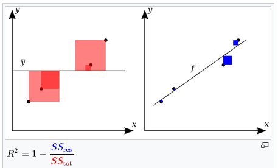

**Условия применимости линейной регрессии**:

1. Линейная взаимосвязь переменных.

2. Нормальное распределение ошибок (residuals).

    
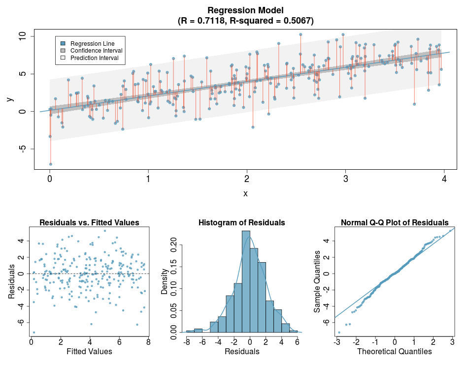

3. Гомоскедастичность ошибок (постоянный уровень изменчивости для всех значений независимой переменной). Пример нарушения (https://gallery.shinyapps.io/slr_diag/):

    
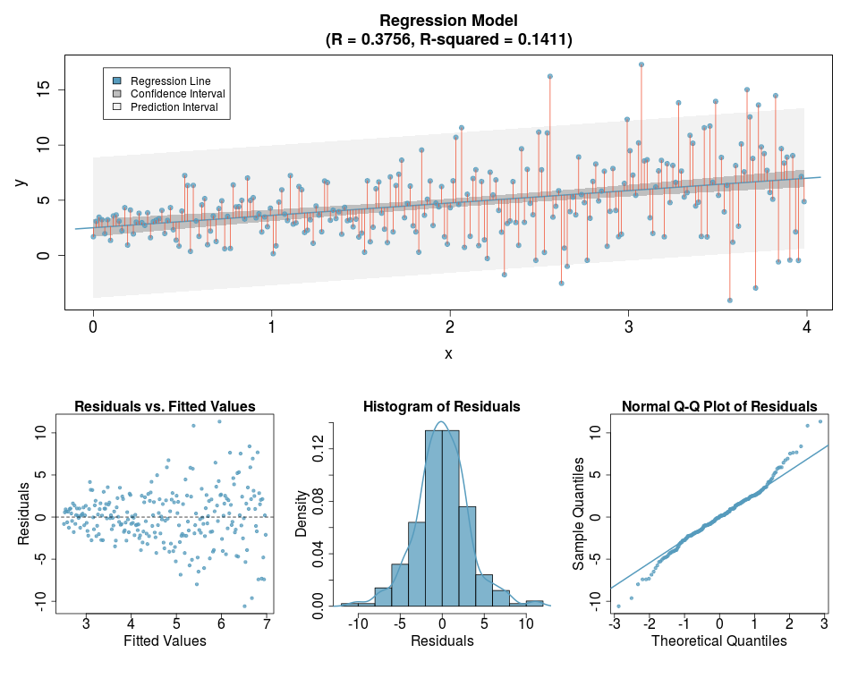

**Пример**:

Связь уровней бедности и образования в штатах США.

Получили статистически значимую отрицательную линейную связь.

**Замечания**:

- Экстраполяция модели за пределы её области применимости не гарантирована.

- Как и в случае с корреляцией модель линейной регрессии ничего не говорит о причинно-следственной связи, т.е. разделение переменных на зависимую и независимую условно.

### 3.3. Регрессионный анализ с несколькими независимыми переменными

Идея аналогична одномерному случаю, только теперь несколько независимых переменных (и, соответственно, уравнение линейной регрессии и МНК определяют уже не прямую, а $n$-мерную плоскость, где $n$ — число независимых переменных).

$$
\hat{y} = b_0 + b_1 \,x_1 + b_2 \,x_2 + \ldots + b_n \,x_n \,.
$$

**Требования к данным**:

1. Линейная взаимосвязь переменных.
2. Нормальное распределение ошибок (residuals).
3. Гомоскедастичность ошибок.
4. Отсутствие мультиколлинеарности.
5. Нормальное распределение переменных (желательно).

Многомерный регрессионный анализ позволяет улучшить модель, исключив фактор **влияния третьей переменной** (например, уровень знаний школьников скоррелирован с их размером обуви только из-за наличия третьей переменной — возраста школьников; т.е. если учесть в модели возраст, то корреляция между первыми двумя переменными исчезнет). Т.о. многомерный анализ лучше одномерного тем, что показывает взаимосвязь между переменными, учитывая их сразу все.

При оценке коэффициента детерминации $R^2$ теперь следует делать поправку на множественные сравнения (**исправленный** $R^2$).

**Пример**:

Проверка наличия взаимосвязи уровня бедности в штатах США c разными социальными факторами.

Получили статистически значимую связь бедности с факторами образования и населения столичного региона штата. Т.о. получили ещё одну независимую переменную, которая скоррелирована с зависимой, т.е. улучшили модель ($R^2$ увеличился).

### 3.4. Выбор наилучшей модели

**Мультиколлинеарность** — сильная взаимосвязь между какими-то независимыми переменными (т.е. две разные переменные по сути отражают один и тот же признак).

Наличие мультиколлинеарности между какими-то независимыми переменными негативно сказывается на модели. Т.е. максимальное количество переменных $\neq$ наилучшая возможная модель.

**Алгоритм подбора оптимальной модели**:

1. Построить модель множественной линейной регрессии.

2. Проверить все переменные на попарные корреляции между друг другом (проверка на мультиколлинеарность).

    
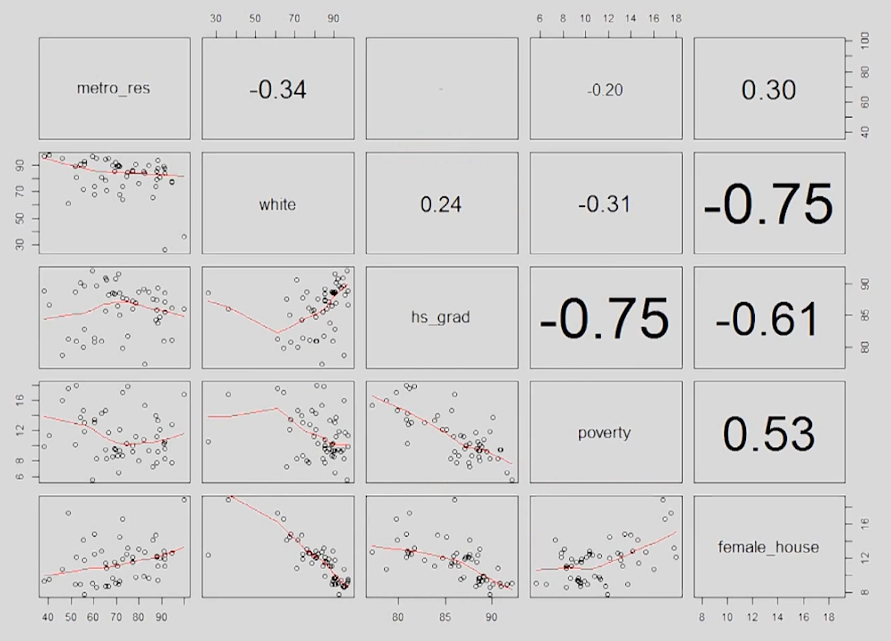

    В данном примере переменная female_house сильно скоррелирована с другими независимыми, от неё и избавляемся.

3. Исключить независимые переменные, не прошедшие тест.

4. Из новой модели по очереди удаляем по одной переменной и считаем для каждого случая $R^2$. Если результат увеличивается, то модель лучше и выбираем её.

    
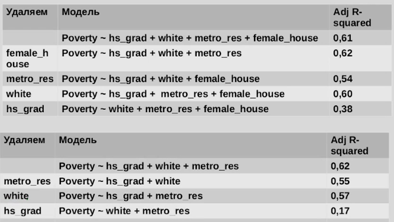

    Получается, что лучшая модель это $poverty = f(grad, white, metro)$. Для неё значение $R^2$ максимально. При этом оказалось, что исключение переменной female_house сделало статистически значимой связь между poverty и white.

    
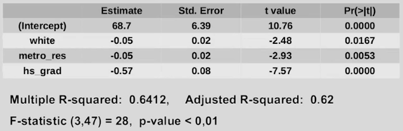

Дополнительные темы:

- кластерный анализ
- логистическая регрессия

